<!-- <link rel="stylesheet" type="text/css" href="markdownpad-github.css"> -->

[Deepixel Inc.]: http://www.deepixel.xyz  
[Build and player settings video]: 
https://unity3d.com/learn/tutorials/topics/interface-essentials/build-and-player-settings?playlist=17090  
[UI Events and Event Triggers]: 
https://unity3d.com/learn/tutorials/topics/user-interface-ui/ui-events-and-event-triggers  
[Using Asset Store]:
https://unity3d.com/learn/tutorials/topics/asset-store/using-asset-store  
[Colliders as Triggers]: https://unity3d.com/learn/tutorials/topics/physics/colliders-triggers  
[PixieUnity API Reference]: https://deepixel-dev1.github.io/pixieunity/api  

<!-- TOC -->

- [Pixie](#pixie)
- [Features](#features)
- [Getting started with pixie](#getting-started-with-pixie)
    - [Prerequisites](#prerequisites)
    - [Getting set up](#getting-set-up)
        - [Installation](#installation)
        - [Configuration](#configuration)
    - [Runs the demo](#runs-the-demo)
        - [Runs in the editor](#runs-in-the-editor)
        - [Runs on an android device.](#runs-on-an-android-device)
    - [Makes 2D pixie demo using ray casting](#makes-2d-pixie-demo-using-ray-casting)
    - [Makes 3D pixie demo](#makes-3d-pixemo)
    - [Makes camera preview and meta menu demo](#makes-camera-preview-and-meta-menu-demo)
- [Reference](#reference)
    - [Pixie properties](#pixie-properties)
    - [Pixie pointer events](#pixie-pointer-events)
    - [Input module states](#input-module-states)
    - [API reference](#api-reference)
- [Needs help? Founds a bug?](#needs-help-founds-a-bug)

<!-- /TOC -->

# Pixie

Pixie is a natural 3D interface using user's hand and fingers.
Pixie is the best interface to VR.

[Deepixel Inc.]

# Features

- 3D Position
  > 3D position calculated using an image of single camera.
  > The position is in the coordinate system with the camera device as the origin.
     
  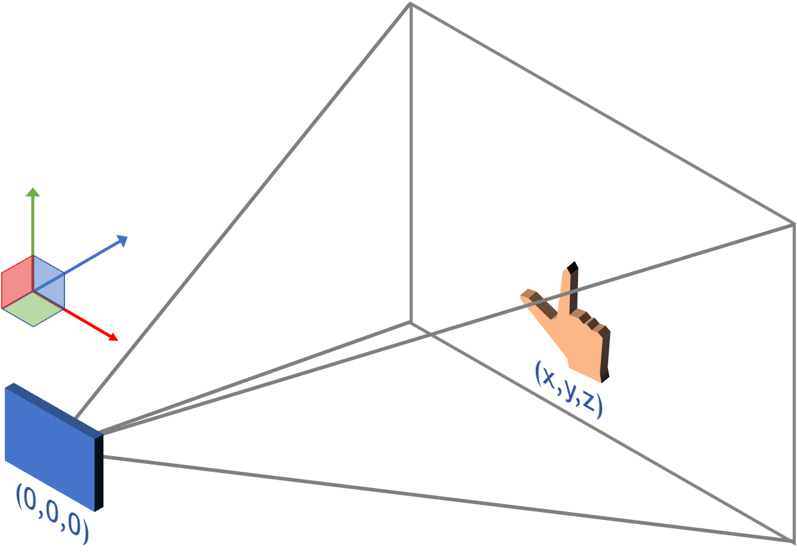

- Events
  > Thumb-in, thumb-out, click and holding events occur depending on 
  > the position of the user's thumb.

- Camera preview
  > It shows the camera image translucently. 
  > This helps the user learn how to use pixie.

- Meta menu
  > Enables/disables camera preview.  
  > Changes transparency of camera preview.  
  > Quits the application.
  
  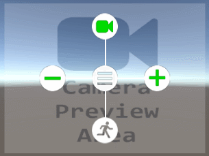 

# Getting started with pixie

## Prerequisites

You're going to need:

- Unity 5.6 or higher.
- Android device that supports marshmallow or higher versions.

## Getting set up

### Installation

1. Runs Unity3D application.
1. Opens asset store window.  
1. Searches pixie.
1. Clicks 'Download' button to download and install pixie unitypackage.  

> Unity tutorial : [Using Asset Store]

### Configuration

1. Opens the build settings window.  
    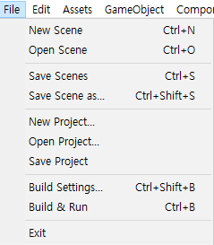

1. Selects android as the target platform.  
    > Pixie only supports android. Later versions will support more platforms.

    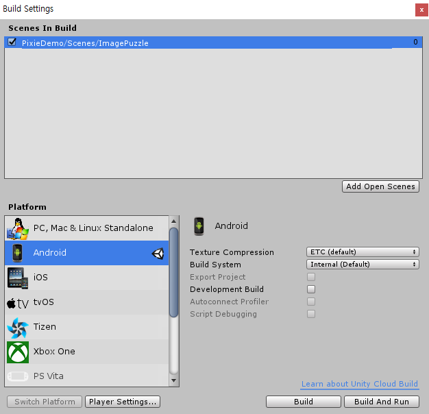

1. Opens the player setting window.  
    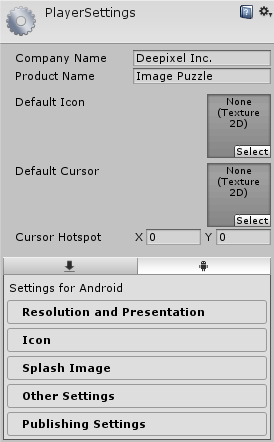

1. Sets the company and product name.  
    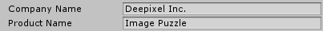

1. Expands the other settings area.  
    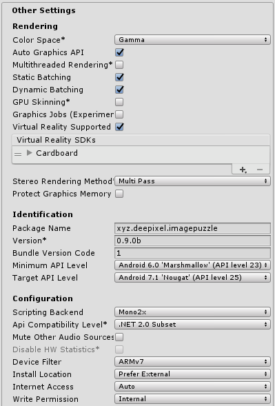

1. Sets the package name.  
    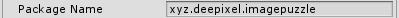

1. Enables 'Virtual Reality supported' option.  
    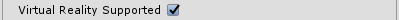

1. Selets cardboard as virtual reality SDK.  
    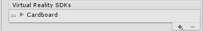

1. Selects minimum API level 23.  
    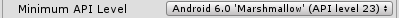

1. Selects target API level 25.  
    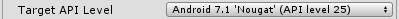

1. Selects ARMv7 device filter.  
    > Pixie only supports ARMv7-A. Later versions will support more architectures.
    
    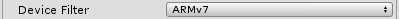

> You can see how to set build and player in Unity via video.  
> Unity tutorial : [Build and player settings video]

## Runs the demo

### Runs in the editor

1. Opens a scene to execute.  
    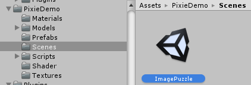

1. Clicks play button at top of screen.  
    

1. To activate the pixie pointer, hold down the shift key.
    - To change the x and y axis coordinates, move the mouse.
    - To change the z-axis coordinate, use the mouse wheel.

1. To generate the pixie events, use the mouse.
    - Thumb-in : press the left mouse button.
    - Thumb-out : release the left mouse button.
    - Click : click the left mouse button.
    - Holding : press and hold the left mouse button.

1. To activate the meta menu, move the pixie to center area. 
   Then, after the reticle pointer change from point to circle, hold down the ctrl key.
    - To navigate the menu, move the mouse.

### Runs on an android device.

1. Opens a scene to execute.  
    

1. Selects the scene to build.  
    > If there is no scene, click 'Add Open Scenes' button.

    

1. Clicks 'Build And Run' button

1. To activate the pixie pointer, extends your hand to the back of device.

    - To change the x-axis coordinate, move your hand left or right.
    - To change the y-axis coordinate, move your hand up or down.
    - To change the z-axis coordinate, move your hand away or close.  
    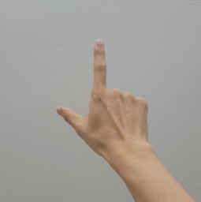

1. To generate the pixie events, use your thumb.
    - Thumb-in  
      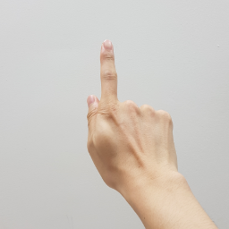
    - Thumb-out  
      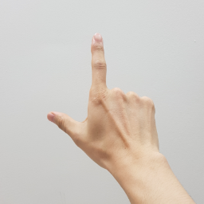
    - Click  
      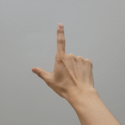
    - Holding  
      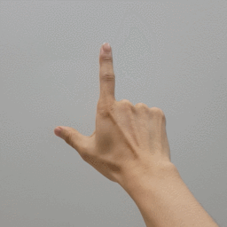

1. To activate the meta menu, move the pixie to center area. 
   Then, after the reticle pointer change from point to circle, change your hand shape as shown below.
    - To navigate the menu, move your hand to left/right/up/down.
    
     

## Makes 2D pixie demo using ray casting

Demo to interact with cube using ray casting. When you select the cube, it disappears.

1. Creates a new scene and opens it.  
    

1. Creates an empty object and rename it to 'EventSystem'.  
    

1. Adds DPInputModule to EventSystem object as a component.  
    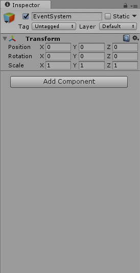  

1. Adds DPPhysicsRaycater to MainCamera object as a component.  
    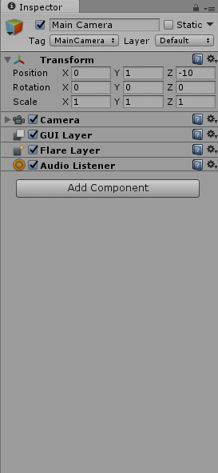  

1. Adds DPPixiePointer2D prefab to MainCamera object as a child.  
    > All prefabs are in "Deepixel\PixieSample\Prefabs" directory.

    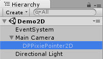

1. Creates a cube object to interact with pixie.  
    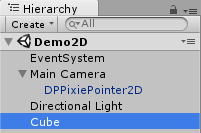
    > Changes the position and scale as below to put the cube in front of the main camera object.

    

1. Adds a event trigger component to handle pointer events.  
    > Unity tutorial : [UI Events and Event Triggers]

    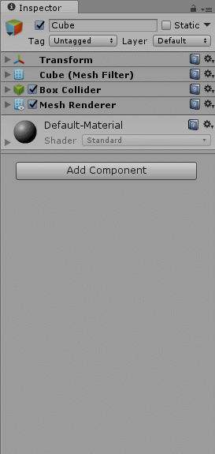  

1. Adds a pointer click event type to the event trigger component and set it as below.  
    

1. Runs this scene. 
    > When you let the pixie pointer to the cube object,
    > you can see that the shape of pixie pointer changes to circle.
    > And the cube disappears when you generate a click event.

    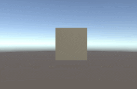

## Makes 3D pixie demo

Demo to make cube disappear by touching cube with pixie without using ray casting.

1. Creates a new scene and open it.  
    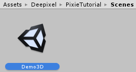

1. Creates a empty object and rename it to 'EventSystem'.  
    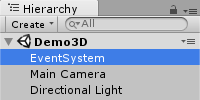

1. Adds DPInputModule to EventSystem object as a component and sets far z plane value to 0.6.  
    > You can determine the z-axis working space of the pixie by adjusting the near z plane and far z plane values.
    
    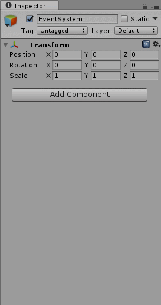  

1. Adds DPPixiePointer3D prefab to MainCamera object as a child.  
    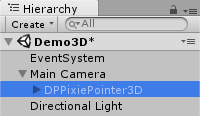

1. Creates a cube object to interact with pixie.  
    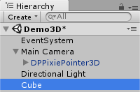
    > Changes the position and scale as below to put the cube in front of the main camera object.

    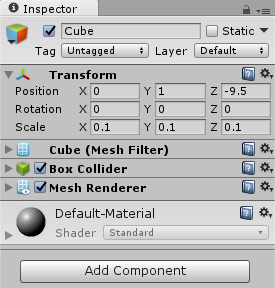

1. Adds a rigidbody component.  
    

1. Adds a component to handle trigger events.  
    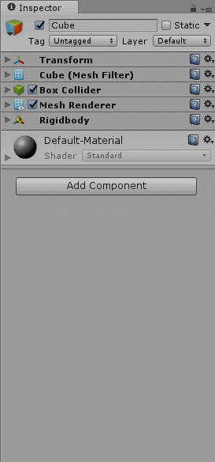  

1. Modifies the code in 'CubeTrigger.cs' as follows.  
    > Unity tutorial : [Colliders as Triggers]  
    ```csharp
    using UnityEngine;

    public class CubeTrigger : MonoBehaviour
    {
        private void OnTriggerEnter(Collider other)
        {
            gameObject.SetActive(false);
        }
    }
    ```

1. Runs this scene in the editor. If you make pixie overlap with the cube by using mouse wheel, 
   you can see that the cube disappears.  
    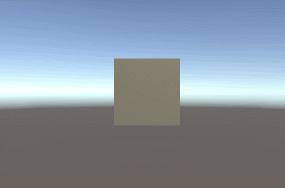

## Makes camera preview and meta menu demo

Demo to display camera preview and control it by using meta menu.

1. Creates a new scene and open it.  
    

1. Creates a empty object and rename it to 'EventSystem'.  
    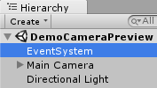

1. Adds DPInputModule to EventSystem object as a component.  
      

1. Adds DPCameraPreviewCanvas, DPMetaMenuCanvas, DPReticlePointer and DPPixiePointer3D prefab 
   to MainCamera object as a child.  
    

1. Runs this scene in the editor.
    > When you let the pixie pointer to the reticle pointer,
    > you can see that the shape of reticle pointer changes to circle.
    > Presses ctrl key to make meta menu visible.
    > To change transparency of camera preview, move the mouse left or right.
    > To disable/enable camera preview, move the mouse up.
    > To exit the application, move the mouse down.  

    

<!--# Advanced features-->

<!--1. ReticlePointer(editable)-->
<!--1. MetaMenu(editable)-->
<!--1. DPGraphicRaycaster-->
<!--1. PixiePointerForMetaMenu(editable)-->
<!--1. PixiePointerForMoving(editable)-->

<!--## Pixie pointer-->

<!--Pixie pointer is an object to indicate position of user's hand in 3D environment.
You can create pixie pointers as desired by inheriting the DPBasePixiePointer class. 
You can see the sample code [here]().
-->
<!-- The sample code in the link below shows how to override DPBasePixiePointer class. -->
<!-- You can see [here](#input-module-events) what functions to override. -->

<!--sample code link.-->

<!--
## Reticle pointer

Reticle pointer is an object to enable additional functionality as follows.

- To activate a [meta menu](#meta-menu), 
  click after overlapping the pixie pointer and the reticle pointer for a period of time.
  You can see [here](#meta-menu) how to make a meta menu.
- To activate a [camera moving pointer](#camera-moving-pointer), 
  hold and move your hand after overlapping the pixie pointer and the reticle pointer for a period of time.
  You can see [here](#camera-moving-pointer) how to move the camera.

You can create a reticle pointer as desired by inheriting the DPBaseReticlePointer class. 
You can see [here](#input-module-events) what functions to override.

sample code link.
-->

<!-- You can activate a [meta menu](#meta-menu) 
  by clicking after overlapping the pixie pointer and the reticle pointer for a period of time. 
- And you can [move the camera](#moving-camera) by holding instead of clicking. -->

<!--
## Meta menu

Meta menu is an object that displays menus that can be launched at any time while the application is running. 
To enable the meta menu, you must enable one or more pixie pointers and a reticle pointer.
You can see [here](#reticle-pointer) how to activate the meta menu.

You can create a meta menu as desired by inheriting the DPBaseMetaMenu class. 
You can see [here](#input-module-events) what functions to override.

sample code link.

## Camera moving pointer

Pixie supports a way to move the camera. 
You can [see](#reticle-pointer) here how to activate the camera moving. 
Also, You can create new pixie to move the camera by inheriting the DPBaseMovingPointer class. 
You can see [here](#input-module-events) what functions to override. 

sample code link.
-->

# Reference

## Pixie properties

Pixie provides 3D position, thumb-in, thumb-out, clicked and holding values as properties. 
The flow chart below shows how these values are determined.

  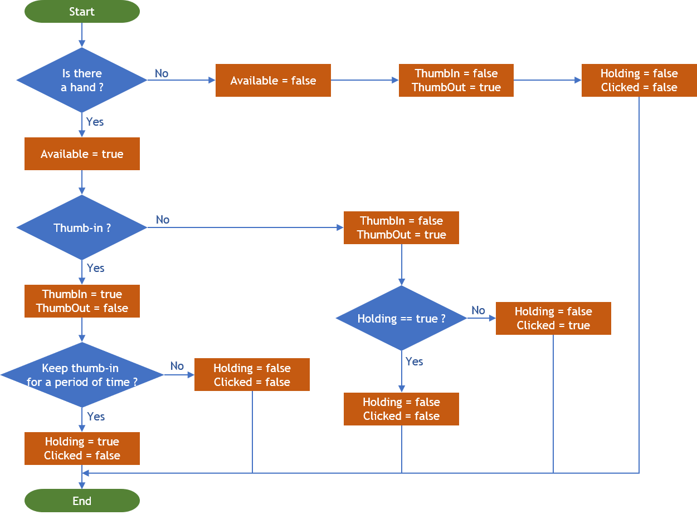

## Pixie pointer events

You could override the functions for the events you are interested in intercepting.  
- OnInputModuleStateChanged()  
  - Called by the EventSystem when [the state of input module](#Input-module-states) is changed.
- OnPointerEnter()
  - Called by the EventSystem when the pointer enters the object associated with EventTrigger.
- OnPointerHover()
  - Called by the EventSystem when the pointer exits the object associated with EventTrigger.
- OnPointerExit()
    - Called by the EventSystem when the pointer hovers the object associated with EventTrigger.

## Input module states

Input module has four states. The flow chart as below shows how these value is determined. 
If the state is changed, the EventSystem call OnInputModuleStateChanged() method.
You could override the function for intercepting [the event](#Pixie-pointer-events).

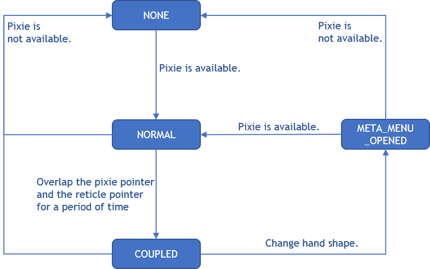

## API reference

Link to [PixieUnity API Reference]

<!--
## Meta menu events

## Reticle pointer events

## Camera moving pointer events

## Pointer events

The order in which the pointer events are called.

PointEnter, PointExit .....
-->

# Needs help? Founds a bug?

Contacts us.

[Deepixel Inc.]